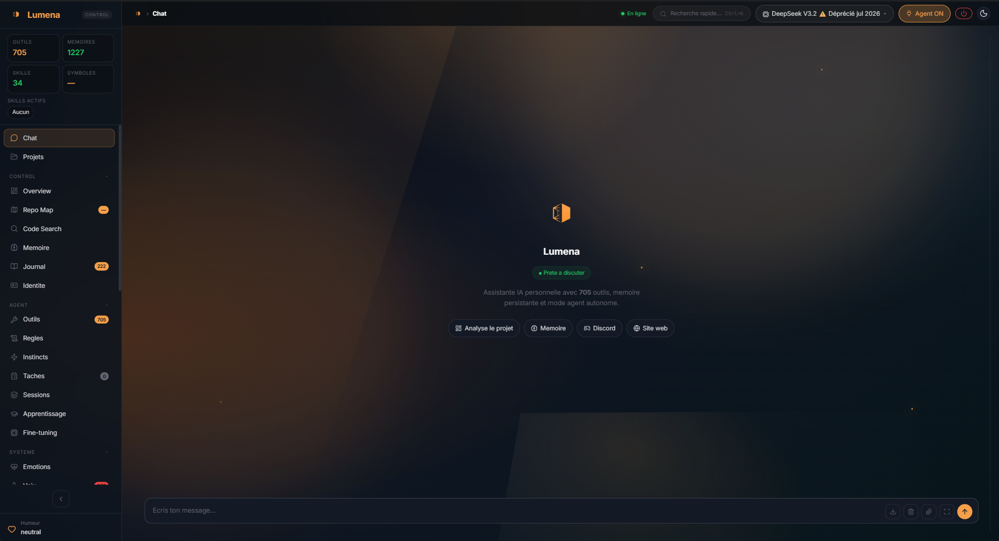

# Lumena

**Autonomous AI assistant with persistent memory, ReAct reasoning, and multi-channel support.**
Raisonne, agit, apprend, s'améliore seul.




> **⚠️ Version Bêta — v1.0.45**
> Lumena est en bêta active. Fonctionnelle pour un usage personnel quotidien, certaines fonctionnalités (voix, agents spécialisés) sont encore en développement actif. Des comportements inattendus peuvent survenir ponctuellement.

> **👤 Projet solo**
> Lumena est développé et maintenu par une seule personne. Des bugs peuvent être présents — certains connus, d'autres moins. Si vous en rencontrez, merci de votre compréhension et n'hésitez pas à ouvrir une issue sur GitHub. Chaque retour compte et aide à améliorer le projet.

---

## Qu'est-ce que Lumena

Lumena est un **assistant personnel IA autonome** — pas un chatbot, pas un wrapper API. Il planifie, exécute des actions réelles sur votre machine, vérifie ses propres résultats, et corrige ses erreurs.

Concrètement : vous lui dites *"crée-moi un site vitrine pour mon restaurant et envoie-le moi par mail"*, il le fait. Pas en vous donnant du code à copier — en l'exécutant lui-même, fichier par fichier, jusqu'à confirmation que ça marche.

Sous le capot : boucle **ReAct** (Think → Act → Observe), **560 outils** organisés en **32 catégories** (1 contrat de sécurité par catégorie) et **26 packs** de routage par mots-clés, **mémoire vectorielle** persistante (ChromaDB), et **contrôle complet du PC** (clavier, souris, navigateur, apps).

### Points forts

| Domaine | Détail |
|---|---|
| **LLM** | 11 providers : Ollama (local), DeepSeek, OpenAI, Anthropic, Google, Mistral, Moonshot, xAI, NVIDIA, MiniMax, Z.AI — **Claude Fable 5 / Mythos 5**, **Claude Opus 4.8** et **MiniMax M3** intégrés — fallback chaîné automatique, réserve premium |
| **Raisonnement** | Boucle ReAct 30 iter, CodeAgent **dev only** (refuse les créations de documents → routées vers les outils natifs), agents spécialisés (Debug, Refactor, Research, Browser, File, Planner) en intégration active |
| **Outils** | **560 handlers V2** dans **32 catégories** (1 contrat de gouvernance par catégorie) : fichiers, web, mail, git, réseau, navigateur (Playwright stealth v2), terminal, vision, images, Stripe, n8n, IDE, computer use, **`data` (data.gouv + SIRENE + géo + workbench)** |
| **Documents** | **46 handlers** (PDF/DOCX/XLSX/PPTX/HTML/CSV), 13 templates Jinja2 (factures, contrats, devis, NDA, bulletins paie…), export PDF via WeasyPrint |
| **Images** | 12 providers (Gemini, OpenAI, Flux, Stability, Imagen, Ideogram, Recraft, Replicate, HuggingFace, xAI, MiniMax, Z.AI), 42 modèles, 15 handlers (generate, edit, compose, thumbnail, upscale, logo, SVG, remove/replace background, sketch-to-image), fallback auto local/gratuit → cheap → premium |
| **Vidéo** | Remotion 4.x (React TSX → MP4/WebM), 5 templates (presentation, social_short, explainer, square_social, custom), rendu local Node.js ou Docker, auto-fix sur erreur de rendu, assets locaux via `staticFile()` |
| **Mémoire** | 4 niveaux : session, ChromaDB vectorielle, Knowledge Graph, BM25 — embedding cache, file watcher |
| **Autonomie** | Scheduler CRON, goals auto-évalués, curiosité, self_improve, cycle quotidien de skills |
| **Computer Use** | Cascade native CU (Anthropic→OpenAI→Google→fallback), pywinauto, vision (Gemini→Claude→Ollama→OCR) |
| **Fine-tuning** | Pipeline local LoRA→GGUF→Ollama automatique, 30 modèles, détection GPU nvidia-smi |
| **Voix** | STT (Whisper) + TTS (Piper / Coqui XTTS provider) — *pipeline de base opérationnel, intégration avancée en cours* |
| **Web** | FastAPI + interface admin complète, chat temps réel (SSE), WebSocket IDE bridge, panel workspaces CodeAgent |
| **Hébergement IONOS** | Déploiement SFTP multi-sites (credentials chiffrés Fernet) + **bridge BDD sécurisé** : les BDD MySQL mutualisées IONOS (`*.hosting-data.io`), injoignables de l'extérieur, sont pilotées via un bridge PHP signé HMAC + AES-256-GCM déployé sur le site. Lecture read-only, write INSERT/UPDATE, CREATE / CLEAR / DROP de tables sandbox, snapshots chiffrés + restauration, DELETE de lignes — **chaque capacité OFF par défaut, confirmation humaine**. L'assistant ne fait que **proposer** (l'humain approuve dans le panel) ; jamais de mysql/php/node en direct, zéro secret/valeur en clair |
| **Multi-Lumena LAN** | Jumelage sécurisé par code court (6 cars, TTL 5 min), peer tokens révocables stockés hashés, délégation de tâches inter-instances, découverte LAN + mDNS/Zeroconf optionnel (`_lumena._tcp.local`) |
| **Sécurité** | Sandbox Docker (auto/always/never), sanitizer commandes, SSRF guard RFC1918 strict, rate limiter, path traversal guard, peer tokens liés à l'instance (anti-usurpation) |
| **Fiabilité** | Cancel coopératif parent→agent, audit structurel des outcomes, tâches bg annulables, TaskProofDecision annotation (evidence + confidence par tâche complétée) |
| **Tests** | **10 678 tests**, 0 failed, ~4 min suite complète |

### Intégration MCP (Model Context Protocol) — autonomie conversationnelle

Lumena intègre le **Model Context Protocol** via une chaîne complète et sécurisée :
catalogue de serveurs, scoring de confiance, découverte de tools, installation isolée dans
`data/mcp/`, activation runtime, policy resolver, approval queue, auto-approve borné,
watcher runtime, diagnostics, configuration de secrets, classification sémantique et
intégration ReAct.

Concrètement, Lumena peut :

- détecter qu'une capacité externe manque ;
- chercher une solution MCP connue, locale, npm ou PyPI ;
- proposer l'ajout au Catalog ;
- créer un ticket d'approbation si la sécurité l'exige ;
- installer le serveur dans le sandbox MCP ;
- l'activer et enregistrer ses outils dans le `ToolRegistry` ;
- utiliser ensuite les tools `mcp__<server_id>__<tool>` comme des outils natifs ;
- désactiver, supprimer, catégoriser ou préférer un MCP depuis la conversation.

Le panel **Infra → MCP** expose la bibliothèque, les approvals, les snapshots runtime,
l'audit/découverte, l'auto-approve, les diagnostics et les actions admin. Le panel
**Documentation** expose aussi les documents MCP opérationnels.

**État actuel :** la chaîne MCP est câblée au runtime conversationnel. Les actions dangereuses
restent protégées par confirmations, opt-in live, politiques, trust score et audit. 
---

## Démarrage rapide

### Compatibilité

| Fonctionnalité | Windows | Linux | macOS |
|---|---|---|---|
| Interface web, chat, LLM | ✅ | ✅ | ✅ |
| Mémoire, autonomie, scheduler | ✅ | ✅ | ✅ |
| Channels (Discord, Telegram…) | ✅ | ✅ | ✅ |
| Navigateur Playwright | ✅ | ✅ | ✅ |
| Documents, images, vidéo | ✅ | ✅ | ✅ |
| Computer Use (contrôle fenêtres, apps) | ✅ | ⚠️ partiel | ⚠️ partiel |

> Le Computer Use natif (contrôle de fenêtres via `pywinauto`, automation d'applications Win32) est conçu pour Windows. Sur Linux et macOS, Lumena démarre et fonctionne normalement — seule cette couche sera limitée.

### Prérequis

- **Python 3.10 – 3.12**
- **Docker Desktop** (optionnel — pour le sandbox d'exécution)
- **Ollama** (optionnel — pour les modèles locaux)

### Installation

```bash
git clone https://github.com/Losskarr/lumena.git
cd lumena
```

**Windows (automatique) :**
```cmd
INSTALL.bat
```

**Linux / macOS :**
```bash
chmod +x install.sh
./install.sh
```

**Manuelle :**
```bash
python -m venv venv
source venv/bin/activate      # Linux/macOS
# venv\Scripts\activate       # Windows

pip install -r requirements.txt
cp .env.example .env
```

### Lancement

**Windows :**
```cmd
START.bat
```

**Linux / macOS :**
```bash
./start.sh
```

**Commandes directes :**
```bash
# Interface web seule (port 8080)
uvicorn web.server:app

# Tout-en-un (web + bots + daemon)
python lumena_ultime.py

# Mode CLI interactif
python -m src

# Daemon autonome 24/7
python run_daemon.py

# Bot Telegram
python run_telegram.py

# Bot Twitter
python run_twitter.py
```

### Configuration minimale

Lumena fonctionne avec **une seule clé API** pour démarrer. Le minimum absolu dans `.env` :

```env
# Au choix — une seule suffit pour commencer
ANTHROPIC_API_KEY=sk-ant-...
# ou
OPENAI_API_KEY=sk-...
# ou
DEEPSEEK_API_KEY=sk-...   # moins cher, très performant
```

Tout le reste (Telegram, Discord, sandbox Docker, mémoire vectorielle) est optionnel et configurable depuis l'interface web.

### One-Click Install (Wizard Web)

Accéder à `http://localhost:8080/setup` pour un assistant guidé qui configure
providers LLM, clés API, Telegram, WhatsApp, Discord, workspace et sandbox Docker.

### Docker

```bash
docker-compose up -d
# → http://localhost:8080
```

---

## Exemples d'usage

```
# Développement
"Crée une API REST Express pour gérer une liste de tâches, avec tests unitaires"
"Corrige le bug dans src/auth.py — les tokens expirent trop tôt"
"Refactorise la classe UserService pour séparer la logique métier du repository"

# Fichiers & documents
"Génère une facture PDF pour le client Dupont — 3 prestations, TVA 20%"
"Lis tous les PDF dans /Downloads et résume les points clés dans un fichier texte"

# Web & communication
"Publie un message sur mon serveur Discord #annonces avec le résumé de la semaine"
"Envoie un mail à mon équipe avec le rapport de progression du projet"

# Autonomie
"Surveille le dossier /projets et résume les nouveaux fichiers chaque matin à 9h"
"Lance le serveur Node.js du projet SynthVault et dis-moi s'il démarre correctement"

# Hébergement & BDD IONOS (via bridge sécurisé, l'IA propose / tu valides)
"Déploie le dossier ./monsite sur openlumena.com"
"Liste les tables de la BDD de openlumena.com et montre le schéma de la table commandes"
"Rajoute une table test à la bdd de openlumena.com"      # → propose une table sandbox
"Vide la table lumena_sandbox_test sur openlumena.com"   # → propose un CLEAR (snapshot avant)
```

---

## Architecture

```
src/
├── core.py                 # LumenaCore — cerveau principal
├── reasoning/
│   ├── react.py            # Boucle ReAct (4 953L)
│   ├── react_config.py     # Config, enums, constantes (400L)
│   ├── tool_registry.py    # ToolRegistry — 32 catégories, 26 packs contextuels
│   ├── intent_router.py    # Router LLM-first + fallback regex
│   ├── response_parser.py  # Parsing ReAct (312L)
│   ├── prompt_builder.py   # Heuristiques statiques (258L)
│   └── handlers/           # 32 catégories, 560 outils V2
│       ├── browser.py      # Playwright stealth v2 (68 handlers)
│       ├── documents.py    # 46 handlers PDF/DOCX/XLSX/PPTX (factures, contrats…)
│       ├── datagouv.py + sirene.py + geo_gouv.py + data_workbench.py  # cat. `data` (14 outils)
│       ├── image_gen.py    # 15 handlers génération d'images (12 providers, 42 modèles)
│       ├── ide.py          # 36 handlers IDE bridge
│       ├── stripe_api.py   # 33 handlers Stripe
│       ├── computer_use.py # 30 handlers CU
│       ├── discord_admin.py # 29 handlers Discord
│       ├── osint.py        # 16 handlers OSINT
│       └── ...             # + autres modules
├── llm/
│   └── multi_provider.py   # 11 providers LLM, fallback chaîné, retry intra-provider
├── memory/
│   ├── chromadb_store.py   # Mémoire vectorielle persistante (966L)
│   ├── knowledge_graph.py  # Relations entre entités (286L)
│   ├── bm25_index.py       # Recherche textuelle classique (291L)
│   └── embedding_cache.py  # Cache embeddings (273L)
├── mcp/                    # Model Context Protocol : catalog, install, activation, ReAct integration
│   ├── react_integration.py # Outils conversationnels MCP exposés au ReAct
│   ├── server_catalog.py    # Catalog des serveurs MCP
│   ├── install_orchestrator.py / activation_service.py
│   ├── capability_resolver.py / proposal_planner.py / execution_bridge.py
│   └── target_resolver.py / category_inference.py / overlap_detector.py
├── autonomy/
│   ├── scheduler.py        # Tâches CRON parallèles (1 617L)
│   ├── daemon.py           # Boucle autonome 24/7 (785L)
│   ├── goals.py            # Objectifs autonomes (498L)
│   ├── curiosity.py        # Exploration thématique (444L)
│   ├── self_improve.py     # Auto-amélioration (1 003L)
│   └── ops_handlers.py     # 15+ handlers opérationnels (2 508L)
├── computer_use/
│   ├── cu_router.py        # Router multi-provider (200L)
│   ├── native_cu.py        # Cascade native Anthropic→OpenAI→Google (932L)
│   ├── controller.py       # Souris, clavier, fenêtres pywinauto (1 169L)
│   ├── vision.py           # Gemini → Claude → Ollama → OCR (1 274L)
│   └── cu_agent_loop.py    # Boucle screenshot → LLM → action (972L)
├── agents/
│   └── sub_agent.py        # CodeAgent + orchestrateur multi-agents, cancel coopératif, registre bg
├── training/               # Pipeline fine-tuning LoRA → GGUF → Ollama
├── perception/             # Lecture documents, knowledge extraction
├── voice/                  # STT Whisper + TTS Piper — en développement actif
│   ├── stt.py              # Transcription vocale (882L)
│   ├── tts.py              # Synthèse vocale (711L)
│   ├── assistant_loop.py   # Boucle vocale interactive (577L)
│   └── providers/          # xtts_provider.py, piper_provider.py
├── tools/                  # IDE bridge (364L), compaction, code index
├── utils/                  # Docker sandbox (365L), persistence, sanitizer (431L), SSRF guard
└── core_services/          # 13 services modulaires

web/
├── server.py               # FastAPI + Uvicorn (port 8080)
├── routes/                 # 18 fichiers routes — 93 endpoints API
├── static/                 # 15 fichiers JS (6 824L) + 9 fichiers CSS
└── index.html              # Interface admin complète (vanilla JS ES modules)

assets/templates/           # 13 templates Jinja2 (documents pro)
models/                     # Modèles TTS Piper + pipeline fine-tuning
tests/                      # 10 678 tests pytest
```

---

## Configuration

Copier `.env.example` vers `.env`. Variables principales :

| Variable | Description | Défaut |
|---|---|---|
| `LUMENA_DEFAULT_MODEL` | Modèle LLM par défaut | `deepseek-v3` |
| `OLLAMA_HOST` | URL du serveur Ollama | `http://localhost:11434` |
| `OPENAI_API_KEY` | Clé API OpenAI | — |
| `ANTHROPIC_API_KEY` | Clé API Anthropic | — |
| `GOOGLE_API_KEY` | Clé API Google (Gemini) | — |
| `DEEPSEEK_API_KEY` | Clé API DeepSeek | — |
| `MISTRAL_API_KEY` | Clé API Mistral (Large, Codestral, Devstral…) | — |
| `ZAI_API_KEY` | Clé API Z.AI | — |
| `TELEGRAM_TOKEN` | Token bot Telegram | — |
| `LUMENA_SANDBOX_MODE` | Mode sandbox : `auto` / `always` / `never` | `auto` |
| `LUMENA_AUTONOMY_EXECUTE_ACTIONS` | Autoriser les actions autonomes | `0` |

Voir `.env.example` pour la liste complète (~150 variables documentées).

---

## Tests

```bash
# Suite complète
python -m pytest tests/ --timeout=15 -q

# Un fichier spécifique
python -m pytest tests/test_react_plan.py -v

# Avec coverage (optionnel)
python -m pytest tests/ --cov=src --cov-report=html
```

Gate CI locale :

```bash
python scripts/ci_phase_gate.py --full --runs=3
```

---

## Docker Sandbox

Lumena exécute le code utilisateur dans un container Docker isolé (`python:3.12-slim`).

| Mode | Comportement |
|---|---|
| `auto` | Commandes Windows → local, code/scripts → Docker |
| `always` | Tout dans Docker (pas de commandes Windows) |
| `never` | Tout en local (comportement classique) |

Configurer via `.env` :

```env
LUMENA_SANDBOX_MODE=auto
LUMENA_SANDBOX_IMAGE=python:3.12-slim
LUMENA_SANDBOX_MEMORY=512m
LUMENA_SANDBOX_CPUS=1
```

---

## Canaux d'interaction

| Canal | Commande | Port | Statut par défaut |
|---|---|---|---|
| **Web** | `python web/server.py` | 8080 | Activé |
| **CLI** | `python -m src` | — | Activé |
| **Telegram** | Configurer `TELEGRAM_TOKEN` dans `.env` | — | Activé si token présent |
| **Discord** | Configurer `DISCORD_TOKEN` dans `.env` | — | Activé si token présent |
| **Twitter/X** | Configurer `TWITTER_*` dans `.env` | — | Activé si tokens présents |
| **WhatsApp** | Credentials Meta Cloud API requis | — | Désactivé (`LUMENA_DISABLE_WHATSAPP=1`) |
| **IDE** | WebSocket bridge (`/ws/ide`) | 8080 | Activé |

---

## Fine-tuning Local

Lumena peut fine-tuner des modèles LLM locaux sur vos propres conversations via Unsloth + TRL.

### Prérequis

- **GPU NVIDIA** avec ≥ 6 Go VRAM (RTX 3060+ recommandé)
- **CUDA 12.1+** et **cuDNN**
- **Ollama** installé et fonctionnel

### Installation des dépendances

```bash
pip install -r requirements-finetuning.txt
```

Ou depuis l'interface web : panneau **Fine-tuning** → **Installer les dépendances**.

### Utilisation

1. Accumuler des conversations dans le pool (automatique via `conversation_logger`)
2. Ouvrir l'interface web → panneau **Fine-tuning**
3. Sélectionner un modèle de base (ex: `qwen3:8b`, `mistral:7b`)
4. Configurer les paramètres (ou garder les défauts)
5. Lancer le fine-tuning → suivre la progression en temps réel
6. Le modèle est automatiquement importé dans Ollama et utilisable

### Modèles supportés

| VRAM | Modèles recommandés |
|------|---------------------|
| 6 Go | Qwen3 4B, Gemma3 4B |
| 8 Go | Mistral 7B, DeepSeek-R1 7B |
| 10 Go | Qwen3 8B, LLaMA 3.3 8B |
| 24 Go | Gemma3 27B |

---

## Réseau Multi-Lumena

Plusieurs instances Lumena sur le même réseau LAN peuvent se découvrir, se jumeler et se déléguer des tâches de façon sécurisée.

### Jumelage par code court

1. Instance A génère un code à 6 caractères (`POST /api/peer/pairing-code`, TTL 5 min, usage unique)
2. Instance B soumet le code avec son `host:port` (`POST /api/peer/validate-pairing-code`)
3. Un échange symétrique de **peer tokens** s'effectue automatiquement — chaque instance stocke le hash du token reçu, jamais le token de l'autre en clair
4. Les deux instances se retrouvent avec `trust: "trusted"` dans leurs registres respectifs

### Sécurité

| Propriété | Détail |
|---|---|
| **Peer tokens** | Stockés hashés (SHA-256), révocables (`POST /api/peer/revoke-token/{id}`), liés à l'`instance_id` (anti-usurpation P1) |
| **Admin token** | Ne sort jamais de l'instance locale — la délégation utilise exclusivement les peer tokens |
| **Anti-SSRF** | Validation RFC1918 stricte (`10/8`, `172.16/12`, `192.168/16`) sur toutes les sorties réseau, incluant les résultats mDNS |
| **Audit** | Chaque tentative de délégation est journalisée (`GET /api/peer/audit-log`) |

### Découverte réseau

```bash
# Scan LAN actif (LUMENA_PEER_DISCOVERY=1)
POST /api/peer/discover

# Découverte mDNS passive (LUMENA_MDNS_DISCOVERY=1 + pip install zeroconf)
GET  /api/mdns/status
POST /api/mdns/browse
POST /api/mdns/advertise
```

Les instances découvertes par mDNS apparaissent avec `trust: "unknown"` — **le jumelage par code reste obligatoire** pour obtenir la confiance.

### Délégation de tâches

```bash
# Instance B délègue une tâche à l'instance A
POST /api/peer/delegate
Authorization: Bearer <peer_token_outbound>

{
  "task_id": "...",
  "from_instance_id": "instance-b",
  "from_user_id": "user",
  "scope": "chat",
  "prompt": "Analyse ce document..."
}
```

### Variables d'environnement

| Variable | Défaut | Rôle |
|---|---|---|
| `LUMENA_PEER_DISCOVERY` | `0` | Active le scan LAN actif |
| `LUMENA_MDNS_DISCOVERY` | `0` | Active la découverte mDNS (`python-zeroconf` requis) |
| `LUMENA_MULTI_INSTANCE` | `0` | Active le mode multi-instance |

---

## Questions fréquentes

**Est-ce que Lumena peut accéder à internet ?**
Oui — recherche web, scraping, APIs REST, téléchargement de fichiers.

**Est-ce que Lumena peut modifier des fichiers sur mon PC ?**
Oui. C'est l'un de ses points forts — elle lit, écrit, exécute. C'est aussi pourquoi le mode sandbox (`LUMENA_SANDBOX_MODE=auto`) est recommandé au départ.

**Quel modèle LLM faut-il pour que ça marche bien ?**
Pour les tâches critiques (raisonnement, création) : **Claude Opus 4.8** (top Opus) ou **GPT-5.x**. Pour le quotidien moins exigeant : DeepSeek V3 (API peu coûteuse) ou Claude Sonnet 4.6 (équilibré vitesse/intelligence). Les modèles locaux Ollama fonctionnent mais sont moins fiables sur les tâches complexes.

**Est-ce que mes données restent chez moi ?**
Oui si vous utilisez Ollama (modèles locaux). Avec les providers cloud (OpenAI, Anthropic, etc.), les conversations transitent par leurs APIs selon leurs CGU respectives.

**Est-ce qu'il faut être développeur pour l'utiliser ?**
Pour l'installation : oui, un minimum de confort avec un terminal est nécessaire aujourd'hui. L'interface web est accessible une fois installé.

---

## Licence

Lumena est publié sous **double licence** :

| Usage | Licence |
|---|---|
| Personnel, open source, académique, associatif | [AGPL-3.0](LICENSE) — gratuit |
| Commercial, SaaS, produit propriétaire | [Licence commerciale](LICENSE_COMMERCIAL.md) — contact requis |

Pour tout usage commercial (intégration dans un produit ou service sans publication du code source), contactez **contact@losskarr.fr**.

Copyright (c) 2025-2026 LossKarr.
