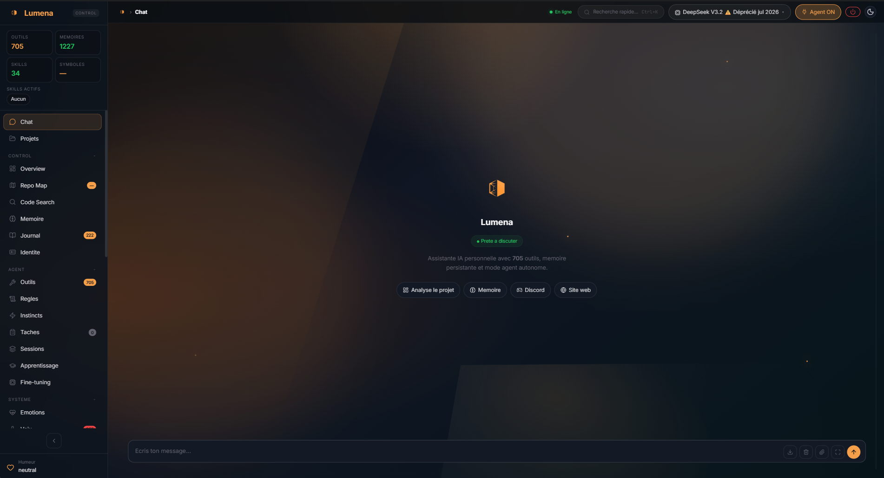
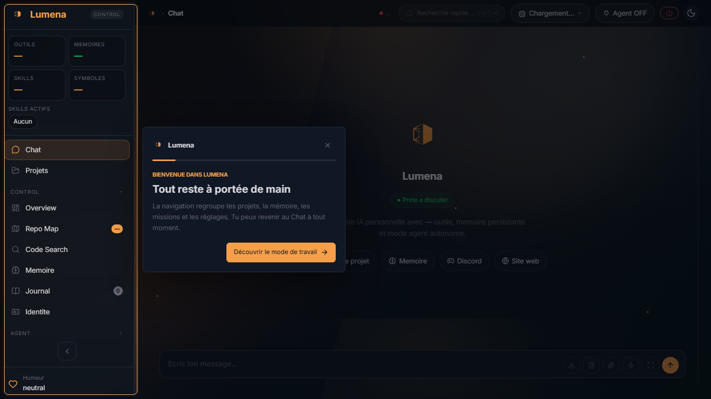

# Lumena

**Assistant IA personnel autonome, local-first, doté d'une mémoire persistante et capable d'agir réellement.**

[](https://www.python.org/)
[](#état-des-composants)
[](#tests)
[](#licence)
[](#état-des-composants)



Lumena réunit dans une seule application le dialogue, l'exécution d'outils, le
développement logiciel, les missions longues, la création documentaire, la
navigation web, la mémoire, les intégrations professionnelles et l'automatisation
locale 24/7.

Elle ne se contente pas de proposer une procédure : en **mode Agent**, elle peut
planifier une demande, appeler ses outils, produire des fichiers, contrôler les
résultats obtenus et rendre compte des preuves réellement observées.

> **Version bêta v1.0.57**
>
> Lumena est utilisable au quotidien et poursuit sa phase de stabilisation.
> Certaines fonctions dépendent d'API, de logiciels locaux, d'identifiants ou
> d'une validation humaine. Une capacité disponible n'est jamais une garantie
> universelle de réussite sur tous les environnements.

---

## Ce que Lumena sait faire

Lumena possède **37 catégories d'outils** et plus de **590 définitions natives**.
Le registre runtime peut dépasser **700 outils** lorsqu'il agrège les outils
dynamiques, les compatibilités historiques, les extensions et les serveurs MCP.
Ces nombres décrivent deux niveaux différents et ne doivent pas être confondus.

### Dialoguer et agir

- deux usages distincts : **Chat** pour dialoguer et **Agent** pour exécuter ;
- routage entre conversation, outil direct, projet et raisonnement multi-étapes ;
- boucle de raisonnement ReAct avec plan, actions, observations et preuves ;
- orientation du travail Agent en cours depuis le chat, avec un mode qui attend
  le prochain point sûr et un mode prioritaire qui reprend dès que possible ;
- plusieurs orientations peuvent être ajoutées sans perdre la demande initiale,
  le plan déjà construit ni les preuves déjà recueillies ;
- plus de **590 outils natifs**, répartis dans **37 catégories** ;
- réponses en streaming, interruption, reprise et suivi des tâches ;
- dialogue vocal avec activation « Lumena », micro ouvert ou push-to-talk,
  interruption, orientations successives et réponses adaptées à la langue ;
- identité, personnalité, humeur et contexte cohérents entre les interfaces ;
- utilisation depuis le web, le terminal, Discord, Telegram, WhatsApp et
  X/Twitter selon la configuration installée.

### Dialoguer par la voix

Lumena Voice utilise le même cœur que le chat et le mode Agent : identité,
contexte, mémoire, permissions, outils et travail en cours restent cohérents lorsque
l'utilisateur passe de l'écrit à la parole. Une interruption vocale peut répondre à
une question ou orienter le travail actif sans effacer l'objectif initial.

Le pipeline réunit reconnaissance et détection de parole locales, activation par
« Lumena », micro ouvert, push-to-talk, synthèse progressive et lecture annulable.
Il sait conduire une conversation en français, anglais ou espagnol, choisir la
voix correspondant à la langue disponible et empêcher la lecture des métadonnées
techniques ou des changements d'humeur. Les profils de performance adaptent les
moteurs au matériel et restent synchronisés avec le panneau Configuration.

Le panneau Voice expose la conversation, la voix, l'écoute, les langues, les
modèles et un diagnostic expurgé. Les contrôles permettent de démarrer ou arrêter
l'écoute, couper la parole courante, rendre la sortie muette, tester le micro et
appliquer un profil. Les enregistrements audio bruts et les transcriptions ne sont
pas journalisés par défaut. La reconnaissance peut rester locale ; la synthèse
utilise un moteur local installé ou un fournisseur optionnel explicitement
autorisé par la configuration.

La qualité du dialogue mains libres dépend du microphone, des haut-parleurs et de
la présence d'une annulation d'écho acoustique. Sans AEC, Lumena utilise un mode
protégé pour distinguer autant que possible la voix humaine de sa propre sortie.
La certification logicielle est disponible, tandis que la campagne d'écoute
humaine, l'endurance et la validation multi-machines restent nécessaires avant de
présenter la voix comme universellement certifiée.

### Réaliser des missions longues

- missions asynchrones suivies depuis le panneau dédié ;
- orientation des missions et de leurs workers depuis le Web ou un canal lié,
  avec ciblage par périmètre et amendements explicites du contrat ;
- délégation à plusieurs workers avec espaces de travail isolés ;
- contrats de fichiers et signatures pour coordonner les projets logiciels ;
- CodeAgent spécialisé pour écrire, corriger et tester du code ;
- vérification des tests, du navigateur, des artefacts et de la publication ;
- clôture honnête : une action non prouvée n'est pas présentée comme réussie ;
- coopération P2P entre plusieurs instances Lumena lorsque cette fonction est
  activée et autorisée.

### Créer et manipuler des documents

- **Document Studio** avec 30 modèles professionnels intégrés ;
- PDF, DOCX, XLSX, PPTX, HTML, CSV et formats texte ;
- factures, devis, contrats, rapports, ressources RH et documents opérationnels ;
- import de modèles utilisateur, personnalisation, logos et aperçu de rendu ;
- lecture, extraction, conversion, génération et modification documentaire ;
- composition documentaire utilisable dans les missions autonomes ;
- ingestion avec découpage sémantique, OCR PDF, extraction d'entités, citations
  et alimentation de la mémoire et du Knowledge Graph.

### Développer et vérifier des projets

- création et modification de projets frontend et backend ;
- opérations Git et GitHub, terminal, fichiers et commandes en sandbox ;
- Repo Map, recherche vectorielle du code, AST, WorldModel et règles projet ;
- diagnostics LSP, navigation vers les définitions et recherche de références ;
- connexion à Lumena IDE par découverte locale et appairage authentifié ;
- catalogue d'outils IDE négocié avec périmètres, politiques et résultats structurés ;
- lecture des buffers non enregistrés, navigation et diagnostics depuis le chat ;
- instance Lumena IDE dédiée à chaque mission qui doit modifier un projet ;
- sessions CodeAgent et historique des modifications ;
- tests unitaires et contrôles d'intégration ;
- prévisualisation locale et vérification par navigateur ;
- contrôle du DOM, captures d'écran et validation d'interactions ;
- génération vidéo avec Remotion et traitement d'images multi-provider.

### Piloter Lumena IDE

Lumena peut ouvrir son IDE, retrouver une instance existante, négocier les
commandes réellement disponibles et agir dans le workspace auquel la connexion
est attachée. Les lectures et la navigation peuvent partir du chat, y compris
pour un buffer qui n'est pas encore enregistré sur disque. Les modifications de
code suivent le rail CodeAgent ou mission et conservent les limites du projet.

Une mission utilise sa propre instance et ne récupère jamais silencieusement la
fenêtre personnelle de l'utilisateur. Une commande acceptée n'est pas confondue
avec un effet terminé : Lumena vérifie le contenu, les diffs, les diagnostics,
les tests et le journal d'exécution avant d'annoncer un résultat. Le skill
**Lumena IDE Operator** lui rappelle ces règles et ne lui accorde aucun droit
supplémentaire.

### Utiliser le web et l'ordinateur

- recherche web, lecture de pages et téléchargement de ressources ;
- navigateur Playwright avec navigation et interactions ;
- campagnes de crawl, recherche approfondie et changement de source en cas de
  blocage ;
- Computer Use avec souris, clavier, fenêtres et vision ;
- garde SSRF, validation des URL et contrôle des commandes ;
- déploiement de sites et intégration IONOS selon les autorisations configurées ;
- diagnostics réseau, WHOIS, DNS, TLS, sous-domaines et outils OSINT encadrés ;
- opérations réseau locales comme SSH, Wake-on-LAN ou transfert distant sous
  politiques de sécurité.

### Mémoriser et apprendre

- mémoire de session et mémoire vectorielle persistante ChromaDB ;
- Knowledge Graph, recherche BM25, cache d'embeddings et contexte de projet ;
- ReflexionStore, SuccessStore, règles apprises et instincts ;
- journal des conversations, faits d'identité et continuité entre sessions ;
- scheduler, objectifs autonomes, curation et cycles d'apprentissage ;
- heartbeat, suivi de santé, rapports quotidiens et sauvegardes contrôlées ;
- micro-évaluations, curation et préparation de jeux de données ;
- modèle personnel local facultatif : collecte consentie, curation, juge isolé,
  entraînement LoRA en processus séparé, versions `lumena-model-x.y.z`, export
  GGUF/Ollama, canari avant activation, sauvegarde et rollback ;
- le modèle principal choisi reste disponible et ne cède la place au modèle
  personnel qu'après une décision explicite de l'utilisateur.

### Produire des images et des vidéos

- génération d'images via plusieurs fournisseurs locaux ou distants ;
- édition, composition, upscale, remplacement ou suppression d'arrière-plan ;
- création de logos, miniatures et ressources SVG ;
- génération de vidéos Remotion en MP4 à partir d'un `VideoSpec` vérifié, avec
  rail sécurisé pour les petits modèles et TSX libre sandboxé pour les modèles
  experts ;
- projets versionnables, preview HTML, progression, annulation, reprise après
  incident, modification avec nouveau rendu et images de preuve contrôlées avant
  apprentissage ;
- runtime Docker Remotion préparé automatiquement au premier rendu, puis rendu
  du code généré sans accès réseau ;
- analyse d'images par les modèles vision déclarés compatibles.

### Travailler avec des données publiques

- recherche et récupération de jeux de données sur data.gouv.fr ;
- interrogation SIRENE pour les entreprises françaises ;
- géocodage et données géographiques françaises ;
- Data Workbench pour charger, explorer, filtrer et exporter des données ;
- lecture de tableaux CSV/XLSX et génération de feuilles de calcul ;
- conservation des sources et des preuves utilisées dans les rapports.

### Piloter des services professionnels

- **GitHub** : dépôts, fichiers, issues et publication de dossiers ;
- **Notion** : recherche, lecture, création, mise à jour et bases de données ;
- **n8n** : workflows, exécutions et modèles d'automatisation ;
- **Stripe** : clients, produits, prix, paiements, abonnements, factures,
  remboursements et liens de paiement ;
- **IONOS** : déploiement SFTP et gestion de base de données par propositions
  soumises à validation ;
- **Mail et messagerie** : emails, pièces jointes, documents Telegram/WhatsApp,
  SMS et appels critiques selon les fournisseurs configurés ;
- **Discord** : serveurs, salons, rôles, permissions et messages ;
- **X/Twitter** : publication, recherche, timeline et mentions ;
- **Spotify** : lecture, pause, file d'attente et morceau courant.

Toutes les intégrations sont optionnelles. Leur présence dans Lumena ne contourne
jamais les quotas, abonnements, permissions ou politiques de leur fournisseur.

### Observer et administrer le runtime

- Overview alimenté par des données réelles en lecture seule ;
- tâches, missions, workers, sessions et conversations persistées ;
- Live Trace SSE, logs, alertes et console ;
- santé des fournisseurs, mémoire, disque et processus ;
- historique d'autonomie et preuves d'exécution ;
- panneau de configuration, catalogue de modèles et assistant d'installation ;
- annulation, reprise, archivage et restauration lorsque le composant le permet.
- état observable des orientations, conservation après rafraîchissement et
  reprise prudente après un redémarrage.

### Étendre ses capacités avec MCP

Lumena intègre le **Model Context Protocol** dans sa boucle conversationnelle :

- découverte et catalogue de serveurs MCP ;
- recherche dans le registre MCP officiel avec cache local ;
- installation isolée npm, Python et binaire d’application hôte ;
- connexion aux serveurs distants Streamable HTTP et SSE historique ;
- authentification distante par secret chiffré ou OAuth avec PKCE ;
- activation à chaud et détection des changements de schéma avant exposition ;
- classification des outils et intégration au registre natif ;
- politiques de confiance, permissions et file d'approbation ;
- utilisation des outils `mcp__<serveur>__<outil>` depuis le mode Agent ;
- recherche, diagnostic, désactivation et suppression depuis le panneau MCP.

Les mutations sensibles restent soumises aux politiques et confirmations de
Lumena. Un MCP externe reste dépendant de son service, de ses droits et de ses
identifiants.

### Charger des skills et des règles

Lumena embarque un système de skills indépendant du fournisseur LLM. Les skills
actuels couvrent notamment la création de sites, les tests web, les documents,
les feuilles de calcul, les présentations, les images, Remotion, Stripe, IONOS,
data.gouv.fr, l'automatisation et la création de nouveaux skills. **Local Model
Manager** encadre le cycle de vie Ollama et Hugging Face ; **Lumena IDE
Operator** guide l'utilisation authentifiée, bornée et vérifiable de l'IDE.

Les fichiers `.lumena_rules` et `.lumena/rules.yaml` permettent également
d'adapter les conventions à chaque projet sans modifier le cœur de Lumena.

<details>
<summary><strong>Voir les 37 catégories d'outils enregistrées</strong></summary>

`agents`, `automation`, `autonomy`, `browser`, `codebase`, `communication`,
`computer_use`, `custom`, `data`, `discord`, `documents`, `files`, `git`,
`github`, `ide`, `image`, `ionos`, `lsp`, `mail`, `mcp`, `media`, `memory`,
`missions`, `network`, `notion`, `peers`, `platform`, `project`, `security`,
`skills`, `social`, `spotify`, `stripe`, `system`, `video`, `web`, `website`.

</details>

---

## Le Control Panel

L'interface n'est pas uniquement une fenêtre de chat. Elle expose les composants
réels de Lumena dans des panneaux spécialisés :

| Espace | Panneaux principaux |
|---|---|
| Travail | Chat, Projets, fichiers et workspaces |
| Contrôle | Overview, Repo Map, Code Search, Mémoire, Journal, Identité |
| Agent | Outils, Règles, Instincts, Tâches, Missions, Documents, Sessions |
| Apprentissage | Datasets, rapports d'apprentissage et Fine-tuning |
| Système | Modèles locaux, Émotions, Voix, Hooks, Live Trace, Console, Logs, Alertes |
| Infrastructure | Telegram, WhatsApp, Autonomie, Réseau/P2P, MCP, Providers, IONOS |
| Commerce | Vue Stripe, Paiements, Abonnements et Produits |
| Administration | Configuration, assistant de démarrage et documentation intégrée |

Les panneaux affichent un état réel ou une action câblée. Les composants encore
partiels sont identifiés comme tels dans la section suivante.

---

## Une seule interface, plusieurs moteurs

Lumena peut utiliser des modèles locaux ou distants sans modifier son interface
de travail :

- Ollama ;
- DeepSeek ;
- OpenAI ;
- Anthropic ;
- Google ;
- Mistral ;
- Moonshot/Kimi ;
- xAI ;
- NVIDIA NIM ;
- MiniMax ;
- Z.AI.

Une session **ChatGPT/Codex** peut également être configurée comme source de
modèle, séparément des fournisseurs utilisant une clé API. La disponibilité des
modèles dépend toujours du compte, de l'abonnement et des droits du fournisseur.

Les modèles d'image utilisent leur propre catalogue et leur propre chaîne de
fallback. Lumena ne présente pas un modèle texte comme capable de générer une
image si cette capacité n'est pas déclarée.

Le catalogue texte suit aussi les générations actuelles destinées au code et
aux agents, dont GPT-6.1 Sol, GPT-6 Astra, Sol et Luna, Claude Opus 5.5,
Claude Sonnet 5.5 et Grok 4.7. Les
modèles à accès restreint, comme Claude Mythos 5.1, restent enregistrés pour la
compatibilité mais ne sont pas proposés sans preuve d'accès. Les transports,
outils, efforts de raisonnement et fallbacks sont adaptés au contrat réel de
chaque fournisseur.

### Modèles locaux sans terminal

Le panneau **Système → Modèles locaux** réunit toute la gestion des modèles
Ollama et des dépôts GGUF du Hub Hugging Face dans Lumena. Il est organisé en
trois espaces complémentaires : **Catalogue** pour rechercher, comparer et
installer, **Mes modèles** pour administrer les modèles présents sur la machine,
et **Opérations** pour suivre les téléchargements et leur état.

Chaque fiche présente les informations disponibles sur le modèle : description,
source, usages, taille, quantification, licence, compatibilité matérielle et
éléments encore inconnus. Lumena peut également recommander un modèle en fonction
du besoin et des ressources détectées, sans transformer cette recommandation en
garantie de compatibilité ou de performance.

Depuis **Mes modèles**, l'utilisateur peut vérifier, activer, choisir, désactiver,
décharger ou supprimer un modèle sans passer par un terminal. Installation,
activation, sélection, chargement et présence sur disque restent des états
distincts. Désactiver conserve les poids ; décharger libère la mémoire ; supprimer
exige un ticket temporaire et une confirmation humaine distincte.

Les mêmes opérations sont disponibles depuis le chat et le mode Agent. Les
outils authentifiés et bornés renvoient des faits structurés, puis le skill
**Local Model Manager** aide Lumena à choisir la bonne opération et à respecter
son ordre d'exécution. Lumena rédige elle-même sa réponse, sans phrase
conversationnelle préenregistrée. Une installation n'est annoncée comme réussie
qu'après la fin du téléchargement et la vérification de l'état réellement observé.
Une demande de recherche ou de conseil ne déclenche jamais silencieusement une
installation, une désactivation ou une suppression.

La recherche Hugging Face utilise l'API officielle et ne propose à
l'installation directe que les dépôts GGUF compatibles avec Ollama. Les dépôts
restreints, les licences et les métadonnées absentes restent signalés au lieu
d'être devinés. Pour Ollama, Lumena recherche l'index public officiel et conserve
une sélection datée comme repli. Comme cet index ne constitue pas une API publique
stable et exhaustive, Lumena signale la couverture partielle et accepte aussi un
identifiant valide saisi directement.

---

## Sécurité et contrôle

Lumena agit sur une machine réelle. Ses garde-fous font donc partie du produit :

- sandbox Docker configurable (`auto`, `always`, `never`) ;
- bornes de chemins et protection contre le path traversal ;
- sanitizer de commandes et restrictions sur les actions destructrices ;
- protection SSRF et registre contrôlé des prévisualisations locales ;
- confirmations pour les opérations sensibles ;
- secrets et identifiants séparés du code ;
- preuves d'exécution conservées dans un ledger ;
- annulation coopérative des tâches et sous-agents ;
- mises à jour vérifiées auprès des releases GitHub, jamais installées
  sans accord explicite.

Lumena doit être utilisée avec un périmètre de fichiers adapté et des droits
minimaux. Les actions externes importantes doivent rester supervisées.


Lumena surveille elle-même les releases publiées et signale une nouvelle
version dans son interface. Elle ne l'installe pas : la notification attend
une décision, et rien ne change sur la machine tant qu'elle n'est pas prise.

---

## État des composants

| Composant | État | Remarque |
|---|---|---|
| Chat et mode Agent | Opérationnel | Deux comportements distincts, même interface |
| Orientation du travail | Opérationnel | Plusieurs consignes, reprise sûre, persistance et états observables |
| Routage et registre d'outils | Opérationnel | Outil direct, projet, ReAct et politiques par catégorie |
| Missions locales et sous-agents | V1 certifiée | Délégation, preuves, artefacts et clôture |
| Lumena IDE | Opérationnel selon environnement | Appairage authentifié, outils négociés et instances de mission dédiées |
| Modèles locaux | Opérationnel selon environnement | Catalogue Ollama et Hugging Face GGUF, cycle de vie contrôlé |
| Document Studio | V1 close | 30 modèles, import et composition en mission |
| Overview | V1 production | Données réelles en lecture seule et widgets configurables |
| MCP | Opérationnel | Les services externes restent conditionnels |
| CodeAgent | Opérationnel | Développement logiciel uniquement |
| Mémoire et continuité | Opérationnel | ChromaDB, BM25, Knowledge Graph et sessions |
| Navigation et vérification web | Opérationnel | La réussite dépend du site et des protections externes |
| Images et Remotion | Clôture logicielle | Runtime Docker préparé, rendu hors réseau, reprise et contrôle de l'artefact |
| Canaux de communication | Opérationnel selon configuration | Tokens, webhooks et droits nécessaires |
| Intégrations professionnelles | Opérationnel selon configuration | GitHub, Notion, n8n, Stripe, IONOS et autres |
| Autonomie 24/7 | Opérationnel avec garde-fous | Actions sensibles conditionnées par les flags et permissions |
| Données publiques et perception | Opérationnel | Services externes et OCR parfois nécessaires |
| Voix V3 (runtime V2) | Clôture logicielle | Campagne humaine, endurance et validation multi-machines encore ouvertes |
| P2P multi-Lumena | Bêta avancée | Certification complète multi-instance encore ouverte |
| Modèle personnel et fine-tuning local | Bêta avancée selon matériel | Consentement désactivé par défaut, jobs reprenables, juge isolé, versions et activation prouvée |
| Hooks | Infrastructure disponible | Branchement produit encore partiel |

---

## Installation



Au premier lancement, Lumena guide la prise en main directement dans son
interface : elle montre où se trouvent les projets, la mémoire, les missions et
les réglages. Le tutoriel se passe, se reprend là où il s'est arrêté, et se
rejoue depuis la configuration.

### Prérequis

- Python 3.10 à 3.12 ;
- Windows, Linux ou macOS ;
- au moins un fournisseur LLM configuré, ou un modèle Ollama local ;
- Docker Desktop en option pour l'isolation générale et requis pour le rendu
  Remotion sécurisé ;
- Node.js pour certaines fonctions web et pour le rendu vidéo local de
  développement explicitement activé.

### Installation rapide

```bash
git clone https://github.com/Losskarr/lumena.git
cd lumena
```

Sous Windows :

```cmd
INSTALL.bat
START.bat
```

Sous Linux ou macOS :

```bash
chmod +x install.sh start.sh
./install.sh
./start.sh
```

Installation manuelle :

```bash
python -m venv .venv

# Linux/macOS
source .venv/bin/activate

# Windows PowerShell
.venv\Scripts\Activate.ps1

pip install -r requirements.txt
cp .env.example .env
```

L'interface est ensuite disponible sur `http://localhost:8080`.

### Configuration minimale

Une seule source LLM suffit pour démarrer. Par exemple :

```env
DEEPSEEK_API_KEY=...
LUMENA_DEFAULT_MODEL=deepseek-flash
```

Les clés API, les modèles locaux, l'abonnement Codex, la voix, les canaux et les
services externes peuvent ensuite être configurés depuis l'interface.

Ne commitez jamais votre fichier `.env`.

---

## Exemples

```text
Crée une application web de suivi de stock avec backend, tests et vérification
réelle dans le navigateur.

Analyse les PDF de ce dossier et génère un rapport DOCX avec un tableau de
synthèse et les sources utilisées.

Prépare une facture à partir de ces données en utilisant mon modèle Document
Studio, vérifie son rendu puis ouvre le résultat.

Surveille ce projet chaque matin, exécute les tests et préviens-moi uniquement
si une régression est prouvée.

Cherche un serveur MCP adapté à ce besoin, présente les permissions demandées et
attends mon approbation avant de l'installer.
```

---

## Architecture

```text
Utilisateur et canaux
        |
        v
Interface web / CLI / Telegram / Discord / WhatsApp / X
        |
        v
LumenaCore et services de contexte
        |
        +-- Routage d'intention
        |     +-- Chat direct
        |     +-- Outil direct
        |     +-- Pipeline projet
        |     +-- ReAct multi-étapes
        |
        +-- ReAct Agent
        |     +-- ToolRegistry (natif + dynamique + MCP)
        |     +-- contrats de catégories et confirmations
        |     +-- skills, règles, instincts et mémoire
        |     +-- ledger de preuves et garde-fous finaux
        |
        +-- Missions
        |     +-- lead
        |     +-- workers isolés
        |     +-- contrat, stubs et fichiers autorisés
        |     +-- CodeAgent et intégration
        |     +-- tests, navigateur, documents et publication
        |
        +-- Capacités
        |     +-- fichiers / terminal / Git / LSP / IDE
        |     +-- navigateur / web / Computer Use
        |     +-- documents / données / images / vidéo
        |     +-- communication / commerce / hébergement
        |
        +-- Mémoire et apprentissage
        |     +-- ChromaDB / BM25 / Knowledge Graph
        |     +-- journal / réflexions / succès / identité
        |     +-- datasets / évaluation / fine-tuning
        |
        +-- Runtime étendu
              +-- autonomie / scheduler / heartbeat
              +-- MCP
              +-- Voice V2
              +-- P2P multi-instance
              +-- télémétrie / alertes / Live Trace
```

Répertoires principaux :

```text
src/                 coeur, raisonnement, outils, mémoire et autonomie
src/reasoning/       boucle ReAct, registre et politiques d'exécution
src/agents/          CodeAgent, Architect et agents spécialisés
src/autonomy/        daemon, scheduler, heartbeat, objectifs et opérations
src/channels/        Discord, Telegram, WhatsApp et X/Twitter
src/computer_use/    vision et contrôle natif de l'ordinateur
src/core_services/   routage, contexte, identité, mémoire et services métier
src/documents/       moteur Document Studio
src/learning/        réflexions, succès, instincts et journaux d'apprentissage
src/llm/             catalogues, profils et routage multi-provider
src/local_models/    catalogue et cycle de vie Ollama et Hugging Face GGUF
src/mcp/             intégration Model Context Protocol
src/memory/          ChromaDB, BM25, Knowledge Graph et contexte de code
src/perception/      lecture documentaire et extraction de connaissances
src/runtime/         orchestration, preuves et coopération
src/services/        fournisseurs et intégrations externes
src/skills/          chargement et sélection des skills
src/telemetry/       événements, traces et suivi des modifications
src/training/        préparation, entraînement, export GGUF et Ollama
src/voice/           STT, TTS et runtime événementiel Voice V2/V3
web/                 API FastAPI et interface utilisateur
assets/templates/    modèles documentaires intégrés
tests/               tests unitaires, intégration et non-régression
plans/               historique technique local et certifications
```

Les compteurs détaillés évoluent rapidement. Le code et les tests constituent la
source de vérité ; le README décrit volontairement l'architecture stable.

---

## Tests

```bash
# Suite complète
python -m pytest tests/ --timeout=15 -q

# Exemple ciblé
python -m pytest tests/reasoning/test_react_plan.py -v
```

La dernière exécution complète connue rend **23 610 tests réussis, 14 ignorés, 0 échec**.
Ce nombre n'est pas une promesse permanente :
chaque modification doit être validée contre la suite correspondant à son
périmètre.

---

## Limites connues

- le projet reste en bêta ;
- les fournisseurs externes peuvent imposer quotas, pannes et restrictions ;
- le Computer Use est plus complet sous Windows ;
- la voix locale attend encore la campagne humaine H1-H15, l'endurance et la
  validation multi-machines avant sa promotion par défaut ;
- la certification P2P multi-instance n'est pas entièrement terminée ;
- les opérations réelles peuvent nécessiter une confirmation ou des identifiants ;
- aucun agent ne peut garantir la réussite de toutes les demandes imaginables.

Ces limites sont affichées pour distinguer les capacités du produit des garanties
qui nécessitent encore une preuve dans l'environnement de l'utilisateur.

---

## Contribuer

Les rapports de bugs reproductibles sont les contributions les plus utiles.
Incluez si possible :

1. la demande envoyée ;
2. le modèle et le fournisseur utilisés ;
3. les lignes de logs pertinentes ;
4. le résultat attendu et le résultat obtenu ;
5. le système d'exploitation et les dépendances externes concernées.

Voir [CONTRIBUTING.md](CONTRIBUTING.md) avant de proposer une modification.

## Licence

| Usage | Licence |
|---|---|
| Personnel, académique, associatif ou open source compatible | [AGPL-3.0](LICENSE) |
| SaaS, intégration propriétaire ou exploitation commerciale | [Licence commerciale](LICENSE_COMMERCIAL.md) |

---

**Lumena v1.0.57 — architecture ouverte, actions contrôlées.**
